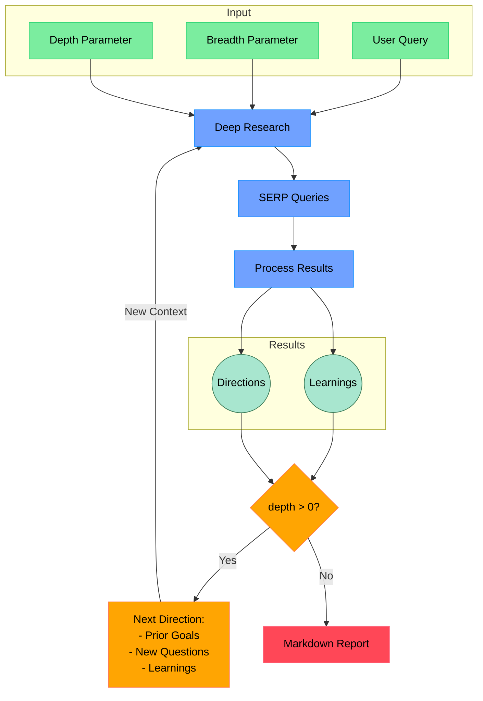

# Open Deep Research

An AI-powered research assistant that performs iterative, deep research on any topic by combining search engines, web scraping, and large language models.

The goal of this repo is to provide the simplest implementation of a deep research agent - e.g. an agent that can refine its research direction over time and deep dive into a topic. Goal is to keep the repo size at <500 LoC so it is easy to understand and build on top of.

If you like this project, please consider starring it and giving me a follow on [X/Twitter](https://x.com/dzhng). This project is sponsored by [Aomni](https://aomni.com).

## How It Works



## Features

- **Iterative Research**: Performs deep research by iteratively generating search queries, processing results, and diving deeper based on findings
- **Intelligent Query Generation**: Uses LLMs to generate targeted search queries based on research goals and previous findings
- **Depth & Breadth Control**: Configurable parameters to control how wide (breadth) and deep (depth) the research goes
- **Smart Follow-up**: Generates follow-up questions to better understand research needs
- **Comprehensive Reports**: Produces detailed markdown reports with findings and sources
- **Concurrent Processing**: Handles multiple searches and result processing in parallel for efficiency

## Requirements

- Node.js environment
- API keys for:
  - Firecrawl API (for web search and content extraction)
  - OpenAI API (for o3 mini model)

## Setup

### Node.js

1. Clone the repository
2. Install dependencies:

```bash
npm install
```

3. Set up environment variables in a `.env.local` file:

```bash
# Required: Firecrawl API for web scraping
FIRECRAWL_KEY="your_firecrawl_key"

# Required: LLM Provider Configuration
LLM_PROVIDER="openai"
LLM_MODEL="o3-mini"
OPENAI_KEY="your_openai_key"
```

See the [LLM Provider Configuration](#llm-provider-configuration) section below for detailed setup instructions.

### Docker

1. Clone the repository
2. Rename `.env.example` to `.env.local` and set your API keys

3. Run `docker build -f Dockerfile`

4. Run the Docker image:

```bash
docker compose up -d
```

5. Execute `npm run docker` in the docker service:

```bash
docker exec -it deep-research npm run docker
```

## Usage

Run the research assistant:

```bash
npm start
```

You'll be prompted to:

1. Enter your research query
2. Specify research breadth (recommended: 3-10, default: 4)
3. Specify research depth (recommended: 1-5, default: 2)
4. Answer follow-up questions to refine the research direction

The system will then:

1. Generate and execute search queries
2. Process and analyze search results
3. Recursively explore deeper based on findings
4. Generate a comprehensive markdown report

The final report will be saved as `report.md` or `answer.md` in your working directory, depending on which modes you selected.

## LLM Provider Configuration

Deep Research supports multiple LLM providers with a simple, unified configuration system. You can easily switch between providers by changing just 2-3 environment variables.

### Quick Start

Set these three environment variables in your `.env.local` file:

```bash
LLM_PROVIDER="openai"           # Provider: openai | fireworks | openrouter | custom
LLM_MODEL="o3-mini"             # Model name (provider-specific)
OPENAI_KEY="sk-..."             # API key for the chosen provider
```

### Supported Providers

#### 1. OpenAI (Default)

Use OpenAI's models including o3-mini, GPT-4o, and more.

```bash
LLM_PROVIDER="openai"
LLM_MODEL="o3-mini"              # or "gpt-4o", "gpt-4o-mini", "o1-mini"
OPENAI_KEY="sk-..."
```

**Recommended Models:**

- `o3-mini` - Best for reasoning tasks (default)
- `gpt-4o` - Most capable, higher cost
- `gpt-4o-mini` - Fast and cost-effective
- `o1-mini` - Advanced reasoning

#### 2. Fireworks AI (DeepSeek R1)

Use DeepSeek R1 and other models via Fireworks AI.

```bash
LLM_PROVIDER="fireworks"
LLM_MODEL="accounts/fireworks/models/deepseek-r1"
FIREWORKS_KEY="fw_..."
```

**Recommended Models:**

- `accounts/fireworks/models/deepseek-r1` - Excellent reasoning (default)
- `accounts/fireworks/models/llama-v3p3-70b-instruct` - Fast and capable
- `accounts/fireworks/models/qwen2p5-72b-instruct` - Strong performance

#### 3. OpenRouter

Access 100+ models from multiple providers through a single API.

```bash
LLM_PROVIDER="openrouter"
LLM_MODEL="openai/gpt-4o"        # See recommended models below
OPENROUTER_KEY="sk-or-..."
```

**Recommended Models:**

- `openai/gpt-4o` - OpenAI's best model
- `openai/gpt-4o-mini` - Fast and affordable
- `google/gemini-2.0-flash-exp:free` - Free, very fast
- `anthropic/claude-3.5-sonnet` - Excellent reasoning
- `meta-llama/llama-3.3-70b-instruct` - Open source, capable
- `deepseek/deepseek-r1` - Advanced reasoning

**Get an API key:** [https://openrouter.ai/keys](https://openrouter.ai/keys)

#### 4. Custom / Local LLM

Use local models via Ollama, LM Studio, or any OpenAI-compatible API.

```bash
LLM_PROVIDER="custom"
LLM_MODEL="llama3.1"             # Your model name
LLM_ENDPOINT="http://localhost:11434/v1"
OPENAI_KEY="not-needed"          # Can be any string for local models
```

**Compatible with:**

- [Ollama](https://ollama.ai) - `http://localhost:11434/v1`
- [LM Studio](https://lmstudio.ai) - `http://localhost:1234/v1`
- [vLLM](https://github.com/vllm-project/vllm) - Custom endpoint
- Any OpenAI-compatible API

### Advanced Configuration

#### Custom Endpoint Override

Override the default endpoint for any provider:

```bash
LLM_PROVIDER="openai"
LLM_MODEL="gpt-4o"
LLM_ENDPOINT="https://custom-proxy.example.com/v1"
OPENAI_KEY="sk-..."
```

#### Context Size

Adjust the maximum context window (default: 128,000 tokens):

```bash
CONTEXT_SIZE="200000"
```

### Legacy Configuration (Deprecated)

The old configuration method still works for backward compatibility, but we recommend using the new `LLM_PROVIDER` approach:

```bash
# Old way (still works)
OPENAI_KEY="sk-..."
CUSTOM_MODEL="gpt-4o"
OPENAI_ENDPOINT="https://api.openai.com/v1"

# New way (recommended)
LLM_PROVIDER="openai"
LLM_MODEL="gpt-4o"
OPENAI_KEY="sk-..."
```

### Troubleshooting

**Error: "No LLM provider configured"**

- Make sure you've set `LLM_PROVIDER` and the corresponding API key
- Check that your API key environment variable matches your provider

**Error: "Invalid LLM_PROVIDER"**

- Valid values are: `openai`, `fireworks`, `openrouter`, `custom`
- Check for typos in your `.env.local` file

**Model not working as expected?**

- Verify the model name is correct for your provider
- Check the provider's documentation for available models
- Ensure your API key has access to the model

### Concurrency

If you have a paid version of Firecrawl or a local version, feel free to increase the `ConcurrencyLimit` by setting the `CONCURRENCY_LIMIT` environment variable so it runs faster.

If you have a free version, you may sometimes run into rate limit errors, you can reduce the limit to 1 (but it will run a lot slower).

## How It Works

1. **Initial Setup**

   - Takes user query and research parameters (breadth & depth)
   - Generates follow-up questions to understand research needs better

2. **Deep Research Process**

   - Generates multiple SERP queries based on research goals
   - Processes search results to extract key learnings
   - Generates follow-up research directions

3. **Recursive Exploration**

   - If depth > 0, takes new research directions and continues exploration
   - Each iteration builds on previous learnings
   - Maintains context of research goals and findings

4. **Report Generation**
   - Compiles all findings into a comprehensive markdown report
   - Includes all sources and references
   - Organizes information in a clear, readable format

## Community implementations

**Python**: <https://github.com/Finance-LLMs/deep-research-python>

## License

MIT License - feel free to use and modify as needed.
